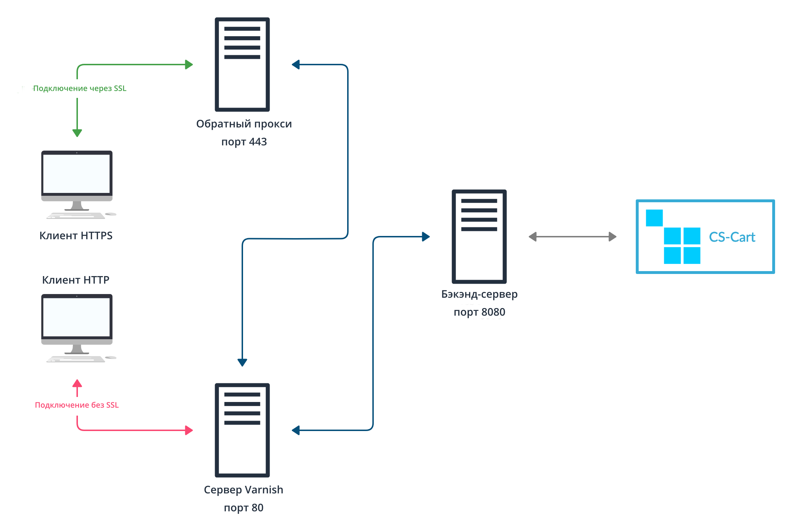

# Модуль полностраничного кэширования для CS-Cart и Multi-Vendor 

## Общая информация

Модуль добавляет поддержку полностраничного кэширования в **CS-Cart** и **Multi-Vendor** 4.3.6 и более новые версии. Полностраничное кэширование снижает нагрузку на сервер и ускоряет загрузку сайта.

* **Без кэширования** страница при каждой загрузке должна выполнять свой код и извлекать данные из БД.

* **С кэшированием** страница генерируется один раз. Потом она может загрузиться из кэша, без необходимости выполнять свой код или обращаться к базе данных.

Для организации полностраничного кэширования мы используем [Varnish Cache](https://varnish-cache.org/). Это свободное программное обеспечение, использующееся в качестве кэширующего прокси-сервера. Подробнее о Varnish можно прочитать тут:

* [Wikipedia](https://en.wikipedia.org/wiki/Varnish_%28software%29)

* [The Big Varnish Picture](https://varnish-cache.org/docs/trunk/users-guide/intro.html)

* [Varnish startup options](https://varnish-cache.org/docs/trunk/reference/varnishd.html#ref-varnishd-options)

* [Varnish and Website Performance](https://varnish-cache.org/docs/trunk/users-guide/performance.html#users-performance)

## Общая схема




## Установка Varnish

Модуль Full-Page Cache поддерживает Varnish 4.1 и более новые версии (например, 6.2).

Для установки Varnish воспользуйтесь следующими статьями:

* [Официальная документация](https://varnish-cache.org/docs/trunk/installation/install.html)

* [Put Varnish on port 80](https://varnish-cache.org/docs/trunk/tutorial/putting_varnish_on_port_80.html)

* [Установка Varnish 4.1 на Ubuntu](https://www.varnish-software.com/wiki/content/tutorials/varnish/varnish_ubuntu.html)

* [How to install Varnish (Tecmint)](https://www.tecmint.com/install-varnish-cache-web-accelerator/)

Varnish должен слушать порт `80` порт и обрабатывать все HTTP-соединения.

## Настройка Varnish и Веб серверов

### Настройка обратного прокси-сервера для HTTPS

Varnish [не поддерживает обработку запросов по HTTPS](https://varnish-cache.org/docs/trunk/phk/ssl_again.html). Если магазин исользует SSL-сертификат, то вам понадобится обратный прокси-сервер (reverse proxy) для работы с Vasnish. Подойдёт любой веб-сервер, но мы рекомендуем **nginx**.

Основная задача reverse proxy — слушать 443 порт и переправлять трафик на порт `80` Varnish-сервера.
Пример конфигурации для nginx:

```bash
server {
    listen              443 ssl;
    server_name         example.com; 
    server_name         www.example.com;

    ssl_certificate     /etc/nginx/certs/example.com.crt;
    ssl_certificate_key /etc/nginx/certs/example.com.key;
    
    location / {
        proxy_set_header Host $host;
        proxy_set_header X-Real-IP $remote_addr;
        proxy_set_header X-Forwarded-For $proxy_add_x_forwarded_for;
        proxy_set_header X-Forwarded-Proto $scheme;
        proxy_pass http://127.0.0.1; 
        proxy_read_timeout 90;
    }
}
```

### Настройка веб-сервера для бэкэнда

Задача бэкэнд-сервера — обработка запросов от сервера Varnish. Для этого бэкэнд-сервер должен быть настроен на прослушивание порта `8080`. Настройте бэкэнд-сервер по следующим статьям:

* [Из официальной документации Apache](https://httpd.apache.org/docs/current/bind.html)

* [Из официальной документации nginx](https://nginx.org/en/docs/http/ngx_http_core_module.html#listen)

### Настройка Varnish

Теперь научим Varnish правильно реагировать на ответы от бэкэнд-сервера. Для этого нужно модифицировать файл [default.vcl](https://varnish-cache.org/docs/trunk/tutorial/backend_servers.html).
В зависимости от способа установки Varnish, *default.vcl* может находиться в разных местах:

* `/etc/varnish/default.vcl`

* `/usr/local/etc/varnish/default.vcl`

Замените этот файл на [наш default.vcl для CS-Cart и Multi-Vendor](var/conf/varnish/default.vcl).

Если бэкэнд-сервер и Varnish физически находятся на разных серверах или используют отличные от документации порты, то поменяйте конфигурацию:

* Настройки адреса бэкэнд-сервера:
    ```bash
        backend default {
            .host = "127.0.0.1";
            .port = "8080";
        }
    ```
    * `host` — IP-адрес бэкэнд-сервера во внутренней сети;
    * `port` — порт, который слушает бэкэнд-сервер.

* Настройки правил безопасности:
    ```bash
        acl internal {
            "127.0.0.1";
        }
    ```
    В этой секции перечислены IP-адреса во внутренней сети, которые Varnish будет считать безопасными. Эти IP-адреса смогут отправлять запросы на инвалидацию кэша.

    **ВАЖНО:** Запросы на инвалидацию кэша отправляется PHP-скриптом. Если вы обрабатываете PHP на одтельном сервере, то его IP-адрес нужно добавить в список разрешённых.


## Установка и настройка модуля Full-Page Cache

[Скачайте архив с модулем с GitHub](https://github.com/cscart/full-page-cache-addon/archive/dev.zip) и [установите его из архива](https://www.cs-cart.ru/docs/latest/user_guide/addons/1manage_addons.html) в CS-Cart или Multi-Vendor.

По умолчанию, модуль уже настроен. Он ожидает, что Varnish установлен на том же сервере. Если это не так, то в настройках модуля укажите правильный IP-адрес сервера Varnish в поле *Host*.

Для включения полностраничного кэширования просто включите модуль.

**ВАЖНО:** При активации модуль попробует инвалидировать кэш. Если всё настроено правильно, то модуль включится. В противном случае, перепроверьте настройки модуля и Varnish Cache.

### Настройки TTL (В разработке)

В будущем модуль позволит указать разное время жизни кэша для разных типов странниц. Планируются следующие настройки:

* время жизни кэша по умолчанию — будет задавать времени жизни кэша для всех страниц, кроме тех, для которых задано своё;

* время жизни кэша главной страницы;

* время жизни кэша страницы категории;

* время жизни кэша детальной страницы товара.


## Схема работы

Кэшированные данные могут использоваться при обработке запросов аналогичных типов. Например, страницы показанные обычному посетителю, могут отличаться от страниц, показанных покупателю. Есть три типа запросов:

* *От пользователей без сессии* — запросы от посетителей, которые просматривают контент, но никак не взаимодействуют с магазином. Например, они не добавляют товары в корзину, не оформляют заказ, не авторизуются и т.п.

  Для таких типов запросов полностраничное кэширование наиболее эффективно, т.к. страницы полностью возвращаются из кэша и не затрагивают бэкэнд-сервер.

* *От пользователей с сессией* — запросы от посетителей, которые каким либо образом взаимодействуют с магазином. Для таких типов запросов кэширование тоже используется. Но блоки, зависящие от сессии (например, корзина), будут подключаться вне кэша через механизм [ESI](https://varnish-cache.org/docs/trunk/users-guide/esi.html). Каждый блок, подключенный через ESI, будет провоцировать запрос на бэкэнд-сервер.

* *От авторизованных пользователей* — запросы от пользователей, которые вошли в учётную запись. Для них будут отдаваться полностью вне кэша. Это связанно с тем, что для авторизованных пользователей контент страниц может значительно отличаться (например, разные цены для разных групп пользователей).

**ВАЖНО:** Полностраничное кэширование работает только для витрины (не для панели администратора) и ограниченно белым списком страниц. Чтобы добавить новую страницу в этот список, расширьте схему `full_page_cache/varnish`.

### Специфика модуля

При активации модуля в силу вступают следующие изменения:

* Отключается автоматический старт сессии. Сессия будет стартовать только при POST-запросах, либо при наличии сессионной куки.

* Добавляется префикс `fpc_` в имя сессионной куки. Это приведёт к обрыву сессий уже авторизованных пользователей.

### Процесс кэширования

По умолчанию, Varnish не кэширует контент, пока бэкэнд-сервер об этом не сообщит. Бэкэнд-сервер общается с через HTTP-заголовки, которые отправляет вместе с контентом:

* `X-Cache-TTL` — время жизни кэша страницы; если этот заголовок отсутствует или равен `0`, контент не будет закэширован.

* `X-Cache-Tags` — зависимости кэша страницы; список тегов, с которыми будет связан кэш страницы.

* `X-Do-ESI` — нужно ли использовать ESI. Если значением этого заголовка является `1`, то Varnish будет использовать [ESI](https://varnish-cache.org/docs/trunk/users-guide/esi.html).
 
### Процесс инвалидации

Инвалидация кэша происходит:

* автоматически, по истечении времени жизни кэша (TTL);

* принудительно, за счёт инвалидации по тегам.

Каждая страница в кэше связана со списком тегов. Как правило, это список таблиц БД, которые были использованы для генерации страницы. Если данные хотя бы одной из таблиц меняются, то кэш страницы будет инвалидирован.

Инвалидация происходит так: бэкэнд-сервер отправляет HTTP-запрос методом `BAN` на сервер Varnish. В заголовке `X-Cache-Tags` перечисляются теги, по которым требуется инвалидация.

**ВАЖНО:** Varnish будет принимать запросы на инвалидацию только от IP, которые есть в белом списке. 
из файла `default.vlc`.

## Известные проблемы

Не работает автоматическое определение языка. Ограничение связанно с большой вариативностью заголовка `Accept-Language`, в котором браузер сообщает предпочитаемые языки клиента. Учёт этого заголовка приведёт к взрывному разрастанию кэша и снизит его эффективность.

## Возможные проблемы

*При открытии в браузере страницы с путём без слэша на конце происходит редирект на порт 8080 и ошибка "No storefronts defined for this domain."*

**Причина:** По умолчанию, при запросе URL вида `http://example.com/path` (без слеша в конце) сервер Apache добавляет т.н. "trailing slash" — возвращает 301 редирект на страницу `http://example.com/path/`.

Когда Apache строит URL, на который будет произведён редирект, он руководствуется значениями своих внутренних настроек — `UseCanonicalName` и `UseCanonicalPhysicalPort`. Когда эти настройки имеют значение *On*, Apache при построении URL для редиректа будет использовать Hostname и Port, указанные в настройках сервера (виртуального хоста).

Если обе настройки имеют значение *Off*, то Hostname и Port будут браться из HTTP-заголовков, которые прислал клиент (браузер).

В нашем случае в настройках виртуального хоста порт — `8080`, а клиент обращается к порту `80`. Apache при построении URL для редиректа использует настройки виртуального хоста.

**Решение:** выставить значения этим настройкам в "Off" в настройках виртуального хоста.
